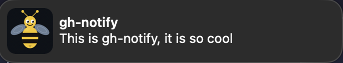
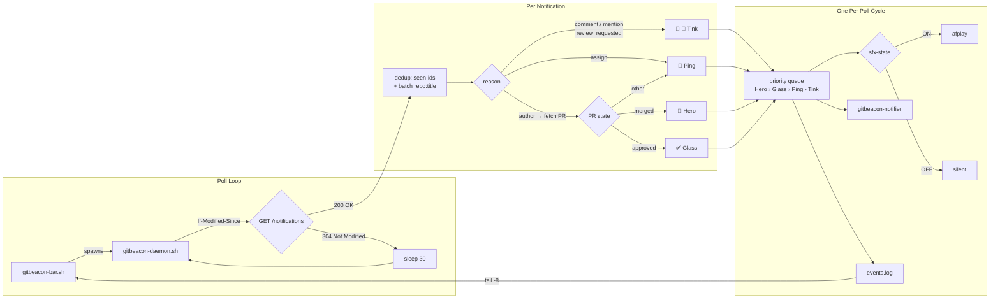

# gitbeacon

<p align="center">
  
</p>

<p align="center">
  <a href="https://github.com/joryeugene/gitbeacon/blob/main/LICENSE"></a>
  
  
</p>

Stay in the hive. macOS-native GitHub notifications with a live terminal bar.

<p align="center">
  
</p>

## macOS Menu Bar App

> **[Download GitBeacon.dmg](https://github.com/joryeugene/gitbeacon/releases/latest)** from GitHub Releases. Open, drag to Applications, launch from Spotlight.

For users who prefer a native app over the terminal, gitbeacon ships as a macOS menu bar app. Download, drag to Applications, double-click. No terminal, no `brew`, no prerequisites beyond `gh auth login`.

The app shows a bell icon in the menu bar. Click it to see a popover with your recent GitHub notification events. The same proven daemon runs underneath. Click any event row to open it in your browser.

<p align="center">
  
</p>

**Build from source:**

```bash
cd GitBeaconApp
swift build
./build/package-app.sh
open .build/GitBeacon.app
```

The app spawns the daemon on launch, adopts an existing daemon if one is already running, and kills it on quit. Sound toggle, event list, and status indicator are all in the popover.

> Requires macOS 14+ (Sonoma) and bash 4+ (Homebrew installs this automatically).

---

## macOS Notification Permissions

gitbeacon ships a custom notification app (`gitbeacon-notifier.app`), a minimal Objective-C `.app` bundle with the KingBee bee icon and bundle ID `com.joryeugene.gitbeacon`. It appears in System Settings as **GitBeacon**.

<p align="center">
  
</p>

**Why a custom app:** `osascript display notification` requires the calling process to be attached to the macOS GUI session. Background daemons run in a detached session with no GUI attachment — notifications sent via `osascript` from a detached process are silently dropped. A proper `.app` bundle with `UNUserNotificationCenter` works from any context, including background daemons.

**One-time setup:** On first use, macOS opens System Settings to request notification permission. Find **GitBeacon** in the list and set the style to **Banners** or **Alerts**. The first launch triggers a permission prompt — click **Allow**.

```bash
# Jump directly to the Notifications pane:
open "x-apple.systempreferences:com.apple.preference.notifications"
```

**After running the installer:** If the bar was already running, it was stopped automatically. Relaunch with `gitbeacon`.

**If banners stop appearing:** Check that Do Not Disturb / Focus mode is off (Control Center, top-right menu bar). Run `just notify "test"` from the repo to send a test notification.

---

## TLDR

**Prerequisites** (one-time):
```bash
brew install gh jq
# tmux is optional — gitbeacon runs in any terminal pane
gh auth login
```

1. **Install**: `curl -fsSL https://raw.githubusercontent.com/joryeugene/gitbeacon/main/install.sh | bash`
2. **Launch**: `gitbeacon` (in any terminal pane)

---

## Events

| Icon | Event | Trigger | Sound |
|------|-------|---------|-------|
| ✅ | Approved | Non-self APPROVED review on your PR | `Glass.aiff` |
| 🔁 | Changes requested | Reviewer requested changes on your PR | `Basso.aiff` |
| 🔀 | Merged | PR merged (author or state_change) | `Hero.aiff` |
| 💬 | Comment / mention | Comment, @mention, or PR review comment | `Tink.aiff` |
| 👀 | Review requested | You were asked to review | `Tink.aiff` |
| 📌 | Assigned | Issue or PR assigned to you | `Ping.aiff` |
| 🚦 | Approval needed | Approval requested on a PR | `Tink.aiff` |
| 👥 | Team mentioned | Your team was @mentioned | `Tink.aiff` |
| 🔒 | Closed | PR or issue closed without merging | `Funk.aiff` |
| 🔓 | Reopened | PR or issue reopened | `Pop.aiff` |
| 📬 | Repo invitation | You were invited to a repository | `Ping.aiff` |
| ❌ | CI failed | Workflow run failed or timed out | `Basso.aiff` |
| 🟢 | CI passed | Workflow run succeeded | `Pop.aiff` |
| ⚙️ | CI running | Workflow run in progress | `Ping.aiff` |
| ⛔ | CI cancelled | Workflow run cancelled | `Funk.aiff` |
| ⚠️ | CI action required | Workflow requires manual action | `Basso.aiff` |
| ⏭️ | CI skipped | Workflow run skipped / neutral / stale | `Ping.aiff` |
| 🛡️ | Security alert | Dependabot or security advisory | `Sosumi.aiff` |
| 🔔 | Activity | All other notification types | `Ping.aiff` |

All sounds are built-in macOS system sounds. No dependencies beyond the prereqs.

---

## Keybinds

| Key | Action |
|-----|--------|
| `s` | Toggle sound ON/OFF |
| `c` | Clear the event log |
| `r` | Restart daemon (if crashed) |
| `o` | Open last event in browser |
| `q` | Quit bar (also stops daemon) |

---

## How It Works



The daemon uses HTTP conditional requests (`If-Modified-Since` / `304 Not Modified`). GitHub's API returns 304 when the notification list hasn't changed since the last poll — these responses don't count against your rate limit.

---

<details>
<summary><strong>Manual installation / custom sesh integration</strong></summary>

**Without the installer:**

```bash
mkdir -p ~/.config/gitbeacon
cp scripts/gitbeacon-daemon.sh ~/.config/gitbeacon/
cp scripts/gitbeacon-bar.sh    ~/.config/gitbeacon/
chmod +x ~/.config/gitbeacon/*.sh
echo "ON" > ~/.config/gitbeacon/sfx-state
touch ~/.config/gitbeacon/events.log ~/.config/gitbeacon/seen-ids

# Install CLI command
mkdir -p ~/.local/bin
cat > ~/.local/bin/gitbeacon << 'EOF'
#!/usr/bin/env bash
exec bash "${HOME}/.config/gitbeacon/gitbeacon-bar.sh" "$@"
EOF
chmod +x ~/.local/bin/gitbeacon
```

**Custom sesh integration:**

Add one line to your existing briefing script:

```bash
# Replace your existing right-pane split with:
tmux split-window -v -l 12% 'gitbeacon'
tmux select-pane -t :.1
```

**Full sesh + gh-dash + gitbeacon example:**

```bash
#!/usr/bin/env bash
# Example: sesh briefing.sh with gitbeacon bar
# Drop into ~/.config/sesh/scripts/briefing.sh (or wherever your sesh script lives)

tmux rename-window -t 1 "BRIEFING"

# Weather (optional — remove if you don't use wttr.in)
printf '\033[1;36m'
curl -s --max-time 3 "wttr.in?format=%l:+%c+%t+%w" 2>/dev/null || true
printf '\033[0m\n'

# Bottom pane: gitbeacon bar (live PR notifications + daemon)
tmux split-window -v -l 12% 'gitbeacon'

# Top pane: gh-dash
tmux select-pane -t :.1
exec gh dash
```

**Run the bar in any terminal pane (tmux example):**

```bash
gitbeacon
```

The bar automatically starts the daemon. When the bar exits, it kills the daemon.

</details>

<details>
<summary><strong>Configuration</strong></summary>

**State files** — all in `~/.config/gitbeacon/`:

| File | Purpose |
|------|---------|
| `events.log` | Appended event lines displayed in the bar |
| `sfx-state` | Contains `ON` or `OFF` — controls sound playback |
| `seen-ids` | Newline-separated processed notification IDs (prevents duplicates) |

**Poll interval:**

Edit `gitbeacon-daemon.sh` and change the `sleep 30` at the bottom of the loop. The default is 30 seconds. Going below 15 seconds is not recommended (GitHub rate limit is 5000 requests/hour; 304 responses don't count toward that limit).

**Sounds:**

Edit the `case "$reason"` block in `gitbeacon-daemon.sh` to swap any sound file. All built-in macOS sounds are in `/System/Library/Sounds/`. Test one with:

```bash
afplay /System/Library/Sounds/Glass.aiff
```

**Bar height:**

Change `12%` in the `split-window` command to any percentage or fixed line count (e.g., `-l 10`).

</details>

---

## Verification

```bash
# 1. Launch the bar
gitbeacon
# Watching for GitHub notifications... (bottom pane)

# 2. Test sound
afplay /System/Library/Sounds/Glass.aiff

# 3. Test popup (uses GH Notifier custom app with bee icon)
~/.config/gitbeacon/gitbeacon-notifier.app/Contents/MacOS/gitbeacon-notifier \
    -title "GH Notifier" -message "Test"

# 4. Check daemon is running
pgrep -f gitbeacon-daemon && echo "daemon running"

# 5. Live trigger
# Open a draft PR, request a review, approve it — bar updates within 30s
```

---

## Troubleshooting

**No events appearing in the bar**
```bash
# Check daemon is running
pgrep -f gitbeacon-daemon && echo "running" || echo "not running"

# Check GitHub auth
gh auth status

# Check events.log for content
cat ~/.config/gitbeacon/events.log
```

**Bar shows events but daemon died mid-session**
```bash
# Kill any orphaned daemon
pkill -f gitbeacon-daemon
# Then relaunch
gitbeacon
```

**Sound not playing**
```bash
# Check current sound state
cat ~/.config/gitbeacon/sfx-state   # should print ON

# Test sound manually
afplay /System/Library/Sounds/Glass.aiff

# Toggle sound in the bar with [s]
```

**Daemon exits immediately on start**
```bash
# The daemon detects and reclaims stale locks automatically.
# If you suspect a stuck state, force-clear manually:
rm -rf ~/.config/gitbeacon/.daemon.lock
```

**Notifications stop after a long session**

GitHub's rate limit is 5000 requests/hour. 304 (not-modified) responses don't count.
If you hit the limit, the daemon sleeps until the window resets (check with `gh api /rate_limit`).

---

## Uninstall

```bash
# Stop the bar and daemon first (press q in the bar, or:)
pkill -f gitbeacon-daemon
pkill -f gitbeacon-bar

# Optional: back up seen-ids if you plan to reinstall
# Without it, all previously-seen notifications re-fire on first poll after reinstall
# cp ~/.config/gitbeacon/seen-ids ~/seen-ids.bak

# Remove scripts, state, and CLI wrapper
rm -rf ~/.config/gitbeacon
rm -f ~/.local/bin/gitbeacon
```
