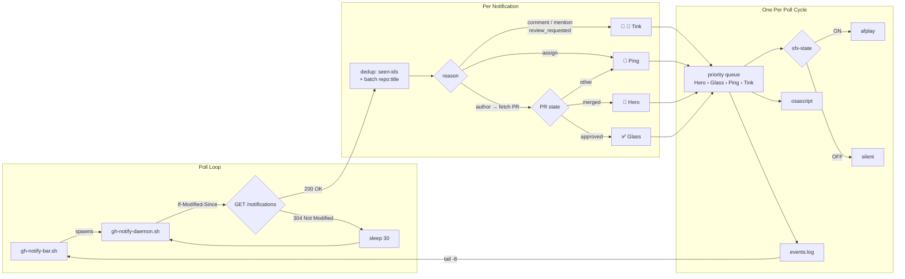

# gh-notify

<p align="center">
  
</p>

<p align="center">
  <a href="https://github.com/joryeugene/gh-notify/blob/main/LICENSE"></a>
  
  
  
</p>

<table><tr>
<td>
  <h3>Real-time GitHub PR notifications with macOS sounds</h3>
  <p>Background daemon that polls GitHub every 30s, fires event-specific sounds and macOS popups, and streams a live log into a small tmux bottom bar. Run it in any tmux session as a persistent notification pane.</p>
</td>
<td align="center">
<pre>
┌─────────────────────────────────────────────────┐
│                                                 │
│              gh dash (full width)               │
│                                                 │
│   PRs  Issues  Repos  ...                       │
│                                                 │
├─────────────────────────────────────────────────┤
│ [12:04] ✅ Approved by alice - Fix auth (org/r) │
│ [12:07] 💬 New comment - Add retry logic (o/r)  │
│ [12:09] 🔀 Merged - Update deps (org/repo)      │
│ ──────────────────────────────────────────────  │
│  [s] sound  [c] clear  [r] restart  [o] open  [q] quit  │
└─────────────────────────────────────────────────┘
</pre>
</td>
</tr></table>

## macOS Notification Permissions

gh-notify uses `terminal-notifier` for reliable notification delivery from tmux. The installer handles installation automatically.

**Why terminal-notifier:** `osascript display notification` requires the calling process to be attached to the macOS GUI session. The tmux server is a background daemon — notifications sent via `osascript` from within tmux are silently dropped. `terminal-notifier` ships as a proper `.app` bundle with notification entitlements that work from any context, including tmux.

**One-time setup:** On first use, macOS opens System Settings to request notification permission. Find `terminal-notifier` in the list and set the style to **Banners** or **Alerts**.

```bash
# Jump directly to the Notifications pane:
open "x-apple.systempreferences:com.apple.preference.notifications"
```

**After running the installer:** If the bar was already running, it was stopped automatically. Relaunch with `gh-notify`.

**If banners stop appearing:** Check that Do Not Disturb / Focus mode is off (Control Center, top-right menu bar). Press `[t]` in the bar to send a test notification.

---

## TLDR

**Prerequisites** (one-time):
```bash
brew install gh jq tmux
gh auth login
```

1. **Install**: `curl -fsSL https://raw.githubusercontent.com/joryeugene/gh-notify/main/install.sh | bash`
2. **Launch**: `gh-notify` (in any tmux pane)

---

## Events

| Icon | Event | Trigger | Sound |
|------|-------|---------|-------|
| ✅ | Approved | Non-self APPROVED review on your PR | `Glass.aiff` |
| 🔀 | Merged | Your PR was merged (or state_change → merged) | `Hero.aiff` |
| 💬 | New comment | Comment or mention on any thread | `Tink.aiff` |
| 👀 | Review requested | You were asked to review | `Tink.aiff` |
| 📌 | Assigned | Issue or PR assigned to you | `Ping.aiff` |
| 👥 | Team mentioned | Your team was @mentioned | `Tink.aiff` |
| 🔒 | Closed | PR or issue closed | `Ping.aiff` |
| 🔓 | Reopened | PR or issue reopened | `Ping.aiff` |
| ❌ | CI failed | Workflow run failed or timed out | `Ping.aiff` |
| 🟢 | CI passed | Workflow run succeeded | `Ping.aiff` |
| ⚙️ | CI running | Workflow run started | `Ping.aiff` |
| ⛔ | CI cancelled | Workflow run cancelled | `Ping.aiff` |
| ⚠️ | CI action required | Workflow requires manual action | `Ping.aiff` |
| 🛡️ | Security alert | Dependabot or security advisory | `Glass.aiff` |
| 🔔 | Activity | All other notification types | `Ping.aiff` |

All sounds are built-in macOS system sounds. No dependencies beyond the prereqs.

---

## Keybinds

| Key | Action |
|-----|--------|
| `s` | Toggle sound ON/OFF |
| `c` | Clear the event log |
| `r` | Restart daemon (if crashed) |
| `o` | Open last event in browser |
| `t` | Send test notification (opens System Settings on failure) |
| `q` | Quit bar (also stops daemon) |

---

## How It Works



The daemon uses HTTP conditional requests (`If-Modified-Since` / `304 Not Modified`). GitHub's API returns 304 when the notification list hasn't changed since the last poll — these responses don't count against your rate limit.

---

<details>
<summary><strong>Manual installation / custom sesh integration</strong></summary>

**Without the installer:**

```bash
mkdir -p ~/.config/gh-notify
cp scripts/gh-notify-daemon.sh ~/.config/gh-notify/
cp scripts/gh-notify-bar.sh    ~/.config/gh-notify/
chmod +x ~/.config/gh-notify/*.sh
echo "ON" > ~/.config/gh-notify/sfx-state
touch ~/.config/gh-notify/events.log ~/.config/gh-notify/seen-ids

# Install CLI command
mkdir -p ~/.local/bin
cat > ~/.local/bin/gh-notify << 'EOF'
#!/usr/bin/env bash
exec bash "${HOME}/.config/gh-notify/gh-notify-bar.sh" "$@"
EOF
chmod +x ~/.local/bin/gh-notify
```

**Custom sesh integration:**

Add one line to your existing briefing script:

```bash
# Replace your existing right-pane split with:
tmux split-window -v -l 12% 'gh-notify'
tmux select-pane -t :.1
```

**Full sesh + gh-dash + gh-notify example:**

```bash
#!/usr/bin/env bash
# Example: sesh briefing.sh with gh-notify bar
# Drop into ~/.config/sesh/scripts/briefing.sh (or wherever your sesh script lives)

tmux rename-window -t 1 "BRIEFING"

# Weather (optional — remove if you don't use wttr.in)
printf '\033[1;36m'
curl -s --max-time 3 "wttr.in?format=%l:+%c+%t+%w" 2>/dev/null || true
printf '\033[0m\n'

# Bottom pane: gh-notify bar (live PR notifications + daemon)
tmux split-window -v -l 12% 'gh-notify'

# Top pane: gh-dash
tmux select-pane -t :.1
exec gh dash
```

**Run the bar in any tmux pane:**

```bash
gh-notify
```

The bar automatically starts the daemon. When the bar exits, it kills the daemon.

</details>

<details>
<summary><strong>Configuration</strong></summary>

**State files** — all in `~/.config/gh-notify/`:

| File | Purpose |
|------|---------|
| `events.log` | Appended event lines displayed in the bar |
| `sfx-state` | Contains `ON` or `OFF` — controls sound playback |
| `seen-ids` | Newline-separated processed notification IDs (prevents duplicates) |

**Poll interval:**

Edit `gh-notify-daemon.sh` and change the `sleep 30` at the bottom of the loop. The default is 30 seconds. Going below 15 seconds is not recommended (GitHub rate limit is 5000 requests/hour; 304 responses don't count toward that limit).

**Sounds:**

Edit the `case "$reason"` block in `gh-notify-daemon.sh` to swap any sound file. All built-in macOS sounds are in `/System/Library/Sounds/`. Test one with:

```bash
afplay /System/Library/Sounds/Glass.aiff
```

**Bar height:**

Change `12%` in the `split-window` command to any percentage or fixed line count (e.g., `-l 10`).

</details>

---

## Verification

```bash
# 1. Launch the bar
gh-notify
# Watching for GitHub notifications... (bottom pane)

# 2. Test sound
afplay /System/Library/Sounds/Glass.aiff

# 3. Test popup
osascript -e 'display notification "PR #42 approved" with title "GitHub: Approved" subtitle "org/repo"'

# 4. Check daemon is running
pgrep -f gh-notify-daemon && echo "daemon running"

# 5. Live trigger
# Open a draft PR, request a review, approve it — bar updates within 30s
```

---

## Troubleshooting

**No events appearing in the bar**
```bash
# Check daemon is running
pgrep -f gh-notify-daemon && echo "running" || echo "not running"

# Check GitHub auth
gh auth status

# Check events.log for content
cat ~/.config/gh-notify/events.log
```

**Bar shows events but daemon died mid-session**
```bash
# Kill any orphaned daemon
pkill -f gh-notify-daemon
# Then relaunch
gh-notify
```

**Sound not playing**
```bash
# Check current sound state
cat ~/.config/gh-notify/sfx-state   # should print ON

# Test sound manually
afplay /System/Library/Sounds/Glass.aiff

# Toggle sound in the bar with [s]
```

**Daemon exits immediately on start**
```bash
# Check for a stale lock file
ls ~/.config/gh-notify/.daemon.lock
# If it exists but no daemon is running, remove it:
rm -rf ~/.config/gh-notify/.daemon.lock
```

**Notifications stop after a long session**

GitHub's rate limit is 5000 requests/hour. 304 (not-modified) responses don't count.
If you hit the limit, the daemon sleeps until the window resets (check with `gh api /rate_limit`).

---

## Uninstall

```bash
# Stop the bar and daemon first (press q in the bar, or:)
pkill -f gh-notify-daemon
pkill -f gh-notify-bar

# Optional: back up seen-ids if you plan to reinstall
# Without it, all previously-seen notifications re-fire on first poll after reinstall
# cp ~/.config/gh-notify/seen-ids ~/seen-ids.bak

# Remove scripts, state, and CLI wrapper
rm -rf ~/.config/gh-notify
rm -f ~/.local/bin/gh-notify
```
